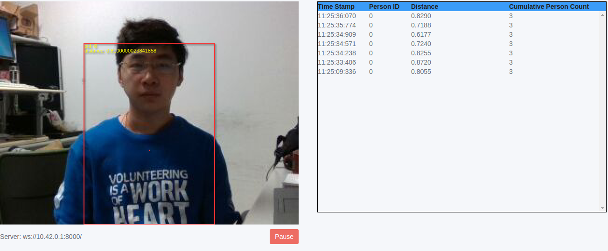
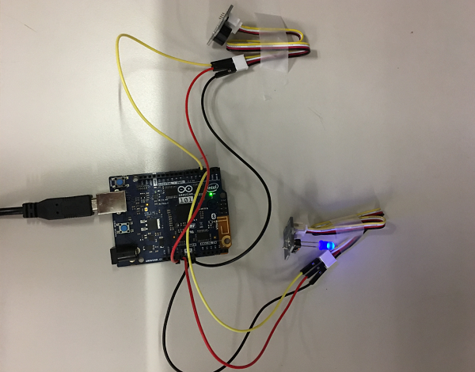

# Demo 1

This GUI app displays the live color preview from the camera within a browser and draw red rectangles around the person(s) detected in the camera frame with a color dot indicating the center of mass for the detected persons in the frame. It also displays the Person ID (pid) for every person and the distance from person to camera. Upon the distance, app could control the light turn on/off automatically.
When people in the 0.5 ~ 1.5 meter from camera, light will turn on, and when people move out 1.5 meter from camera light will turn off.

## Bootstrap

```
$ npm install
```

## Run

```
$ node main.js
```

Note: Open a brower in any remote machine that is on the same network as target, enter url "TargetIPaddr:8000/view.html". Ex:10.30.90.130:8000/view.html
Person can be recognized and the recognition database can be stored when clicking the person to track him/her. The stored database can also be loaded.

## Screenshot

When person in front of camera at different distance, light turns on/off.



