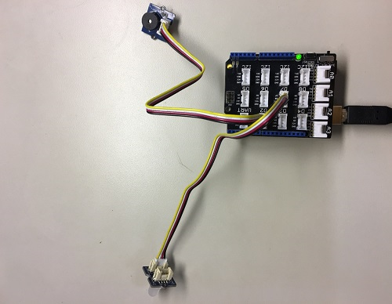

# Setting up the OCF servers
## Setting up the HW
You need the devce and sensors in the following list:
- 3 x [Arduino 101](https://store.arduino.cc/usa/arduino-101)
- 1 x [Grove Buzzer](http://www.seeedstudio.com/wiki/Grove_-_Buzzer)
- 1 x [Grove Chainable RGB LED](http://www.seeedstudio.com/depot/twig-chainable-rgb-led-p-850.html?cPath=156_157)
- 1 x [Grove Base Shield](https://www.seeedstudio.com/Base-Shield-V2-p-1378.html) (optional)
- 1 x [Grove Mini Fan](http://www.seeedstudio.com/wiki/Grove_-_Mini_Fan)
- 1 x [Grove - Gas Sensor(MQ2)](http://www.seeedstudio.com/depot/Grove-Gas-SensorMQ2-p-937.html)
- 1 x [Grove Temperature & Humidity sensor](http://wiki.seeed.cc/Grove-TemptureAndHumidity_Sensor-High-Accuracy_AndMini-v1.0/)
- 1 x [Grove LCD RGB panel](http://www.seeedstudio.com/wiki/Grove_-_LCD_RGB_Backlight)

### Wiring
For Arduino 101 pin number, please refer to [here](https://www.zephyrproject.org/doc/boards/x86/arduino_101/doc/board.html#arduino-101-pinout)

|       Sensor      |   Pin               |          Link            |
|:-----------------:|:-------------------:|:------------------------:|
| Buzzer            |   GPIO 4 (D2)       | [Grove Buzzer](https://www.seeedstudio.com/Grove-Buzzer-p-768.html) |
| RGB LED           |  	8--Clock, 7--Data (D7) | [Grove Chainable RGB LED](http://www.seeedstudio.com/depot/twig-chainable-rgb-led-p-850.html?cPath=156_157) |
| Mini Fan          |   GPIO 2 (D2)       | [Grove Mini Fan](http://www.seeedstudio.com/wiki/Grove_-_Mini_Fan) |
| Gas               |   Aio 0  (A0)       | [Grove - Gas Sensor(MQ2)](http://www.seeedstudio.com/depot/Grove-Gas-SensorMQ2-p-937.html) |
| Temperature & Humidity| I2C (I2C) | [Grove Temperature & Humidity sensor](http://wiki.seeed.cc/Grove-TemptureAndHumidity_Sensor-High-Accuracy_AndMini-v1.0/) |
| LCD Panel | I2C (I2C) | [Grove LCD RGB panel](http://www.seeedstudio.com/wiki/Grove_-_LCD_RGB_Backlight) |

Mount LED with one Arduino 101 board as shown in the following picture via Grove Base Shield(Connect buzzer to D2, RGB LED to D7 ) or connect the pins to board directly (buzzer need to connect `SIG` to Pin `GPIO 2`):

Mount fan and gas to second board, termperature & humidity and LCD to third borad.
