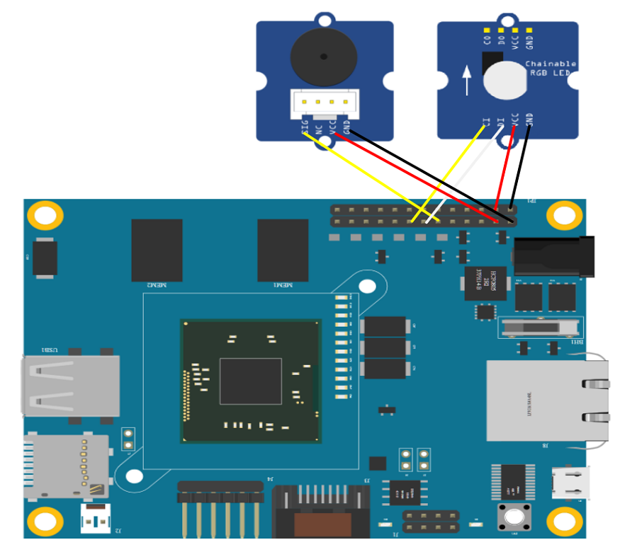

# JavaScript OCF servers
This folder contains JavaScript implementation of the following OCF servers:
* Buzzer (x1)
* LED (x1)

# Setting up the OCF servers
## Setting up the HW
You need the devce and sensors in the following list:
* 1 x [Arduino 101](https://store.arduino.cc/usa/arduino-101)
* 1 x [Grove Buzzer](http://www.seeedstudio.com/wiki/Grove_-_Buzzer)
* 1 x [Grove Chainable RGB LED](http://www.seeedstudio.com/depot/twig-chainable-rgb-led-p-850.html?cPath=156_157)
- 1 x [Grove Base Shield](https://www.seeedstudio.com/Base-Shield-V2-p-1378.html) (optional)

### Wiring
For Arduino 101 pin number, please refer to [here](https://www.zephyrproject.org/doc/boards/x86/arduino_101/doc/board.html#arduino-101-pinout)

|       Sensor      |   Pin  |          Link            |
|:-----------------:|:------:|:------------------------:|
| Buzzer            |   GPIO 4   |[Grove Buzzer](https://www.seeedstudio.com/Grove-Buzzer-p-768.html) |
| RGB LED |  	8--Clock, 7--Data | [Grove Chainable RGB LED](http://www.seeedstudio.com/depot/twig-chainable-rgb-led-p-850.html?cPath=156_157) |

Mount LED with Arduino 101 board as shown in the following picture via Grove Base Shield(Connect buzzer to D4, RGB LED to D7 ) or connect the pins to board directly (buzzer need to connect `SIG` to Pin `GPIO 4`):

